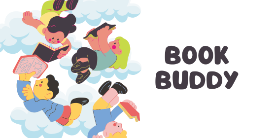

# Agentic AI Book Buddy

Book Buddy is a multi-agent novel recommendation system that understands *why* a reader likes certain books rather than relying on ratings or popularity.

Built using Google Agent Development Kit (ADK) and Gemini, the system analyses a user’s favourite novels to construct a preference profile and then searches for new book recommendations that match themes, tone, writing style, pace, and audience while avoiding spoilers.

## How it works

1. The user provides exactly three novels they enjoyed.

2. A preference extractor agent analyses these books to infer genres, themes, tone, pacing, writing style, and audience.
3. A search agent uses Google Search to find candidate novels that closely match the extracted preferences.
4. An orchestrator agent evaluates the candidates and selects the most suitable recommendation.
5. Session-level preferences can be stored and reused to improve future recommendations.

## System Architecture

The system is designed as a multi-agent architecture with clearly separated responsibilities:

- **Preference Extractor Agent**  
  Extracts structured reading preferences from the user’s favourite novels.

- **Book Search Agent**  
  Searches the web for novels that match the extracted preferences using Google Search.

- **Novel Recommender Orchestrator**  
  Coordinates agents, manages control flow, and produces the final recommendation.

## Tech Stack

- Google Agent Development Kit (ADK)
- Gemini 2.5 Flash Lite
- Multi-agent orchestration
- Google Search tool
- Session state and long-term memory
- Kaggle notebooks
## Key Features

- Multi-agent, role-based design
- Deep preference profiling based on liked books
- Spoiler-free recommendations
- Explainable recommendations with reasoning
- Modular architecture that avoids a monolithic LLM pipeline

## Limitations

- Preferences are inferred only from liked books, not dislikes.
- The system currently recommends one novel per session.
- Model behaviour depends on API quotas.

## Future Improvements

- Incorporate explicit dislike signals
- Add an interactive frontend using ADK GUI

## Usage

This project is implemented and demonstrated using a Kaggle notebook.

View the notebook here:
https://www.kaggle.com/code/shajiaalianwar/agentic-ai-book-buddy

## Author

Shajia Ali Anwar  
An extended and refined version of my capstone project from the Kaggle 5-Day AI Agents Intensive Course with Google
